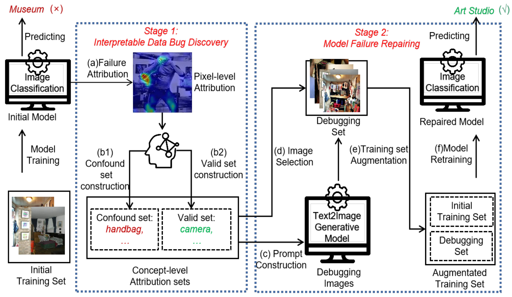

# AADA: Concept-level Attribution Analysis-based Data Augmentation for Human-centered Data Debugging.

This repository contains PyTorch implementation of our paper [AADA: Concept-level Attribution Analysis-based Data Augmentation for Human-centered Data Debugging.]()



* This repo is a modification on the [MAE repo](https://github.com/facebookresearch/mae). Installation and preparation follow that repo.


## Fine-tune
```
OMP_NUM_THREADS=1 python -m torch.distributed.launch --nproc_per_node=4 --use_env main_finetune.py    
 --accum_iter 4     
 --batch_size 64
 --model vit_base_patch16     
 --epochs 100     
 --blr 5e-4 
 --layer_decay 0.65     
 --weight_decay 0.05 
 --drop_path 0.1 
 --mixup 0.8 
 --cutmix 1.0 
 --reprob 0.25  
 --data_path ./places365/generated_based_12_prompt_with_concept_debugset/    
 --output_dir ./12_sub_classes_prompt_with_concept_based_output_dir    
 --log_dir ./12_sub_classes_prompt_with_concept_based_output_dir   
 --dist_eval
```

The following table provides the fine-tuned checkpoints used in the paper:
<table><tbody>
<!-- START TABLE -->
<!-- TABLE HEADER -->
<th valign="bottom">Debug-Train method\checkpoints</th>
<th valign="bottom">Checkpoints</th>

<!-- TABLE BODY -->
<tr><td align="left">S-Random</td>
<td align="center"><a href="https://drive.google.com/drive/folders/14T2EqYXCLUAPheIUHm9VFZdxLzduN45I">download</a></td>
</tr>
<tr><td align="left">S-Similarity</td>
<td align="center"><a href="https://drive.google.com/drive/folders/1zhV-jg0qjHDfLyFFn_458dIfHRwBWuqP">download</a></td>

</tr>
<tr><td align="left">S-Active Learning</td>
<td align="center"><a href="https://drive.google.com/drive/folders/1sxSpsx2gQVA0Mdh4IaJgvcoXXdXaF_Su">download</a></td>

</tr>
<tr><td align="left">G-LLM</td>
<td align="center"><a href="https://drive.google.com/drive/folders/1WCyXBOGMomnKLYAT7HB9qxc8yOl6vJlA">download</a></td>
</tr>
<tr><td align="left">G-TG</td>
<td align="center"><a href="https://drive.google.com/drive/folders/1wTDmIKg2361E5j6IaYL0AR-8g257NvzQ">download</a></td>
</tr>
<tr><td align="left">G-LLM-prompt</td>
<td align="center"><a href="https://drive.google.com/drive/folders/1QSr7l7UXQYda7oJT6I6dbgWzOfLRGKZD">download</a></td>
</tr>
<tr><td align="left">Ours</td>
<td align="center"><a href="https://drive.google.com/drive/folders/1jf57OVnTaTEkI7icSU9FVBDT9zHeSCfX">download</a></td>
</tr>

</tbody></table>

## Datasets

All datasets will be released soon.


